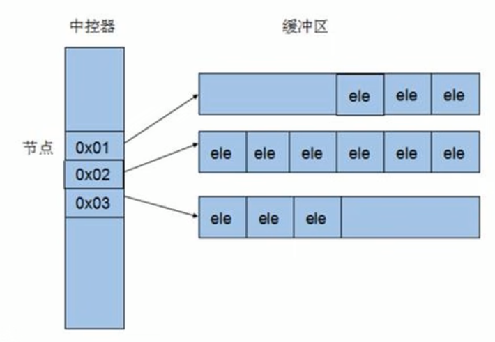
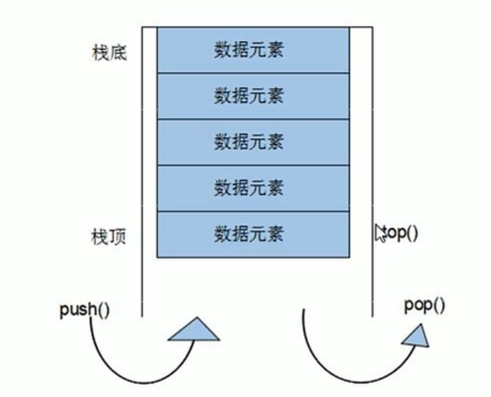
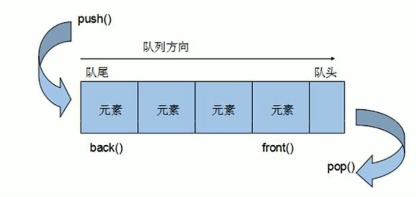
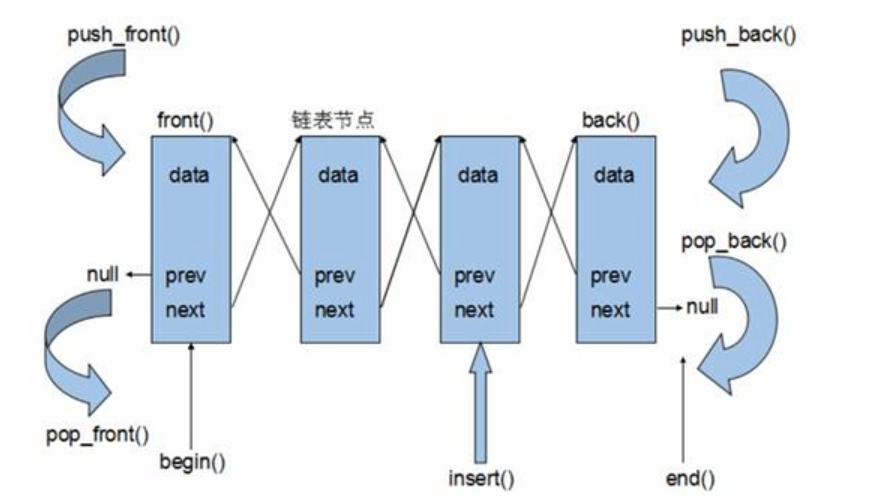

### 2.2 vector

#### 2.2.1 初识vector容器

基本语法如下
例：
```cpp
    //创建一个vector容器
    vector<int> v;

    //创建一个vector容器存放自定义数据类型Person
    //vector<Person> v_p;

    //向容器中插入数据1
    v.push_back(1);

    //通过迭代器访问容器中的数据
    vector<int>::iterator itBegin = v.begin();//起始迭代器，指向容器中的第一个元素
    vector<int>::iterator itEnd = v.end();//结束迭代器，指向容器中最后一个元素的下一个元素
```

注意：v.end()所指向的时***最后一个元素的下一个元素 ***

遍历方式

- 三种遍历方式：
- while
- for
- for_each

```cpp 
    //第一种遍历方式
   while(itBegin != itEnd){
       cout << *itBegin << endl;
       itBegin++;
   }

    //第二种遍历方式
   for(vector<int>::iterator it = v.begin(); it != v.end(); it++){

   }

    //第三种遍历方式
    for_each(v.begin(), v.end(),myPrint);
```
注意：vector<type>::iterator it中的it是vector容器的***指针***指向容器中的数据

#### 2.2.2 vector容器嵌套容器

```cpp
    //构造
    vector<vector<type>> v_nest;
```

### 2.3 string

本质：
- string是C++风格的字符串，而string本质上是一个类
  ***string和char*区别：
- char*是一个指针
- string是一个类，类内部封装了char*,管理这个字符串，是一个char*型的容器

特点：
string类内封装了很多成员方法
例如：查找find，拷贝copy，删除delete，替换replace，插入insert
string管理char*所分配的内存，不用担心赋值越界和取值越界，由类内部进行负责

#### 2.3.1 string构造函数

构造函数原型：
- `string();`                   //创建一个空的字符串 例如：string str;
- `string(const char* str);`    //使用字符串s初始化
- `string(const string& str)`   //使用一个string对象初始化另一个string对象
- `string(int n, char c)`       //使用n个字符c初始化

#### 2.3.2 string拼接

功能描述：
- 实现在字符串末尾凭借字符串

几种方式：
- `string& operator+=(const char* c);` //重载+=操作符
- `string& operator+=(const char c);` //重载+=操作符
- `string& operator+=(const string& str);` //重载+=操作符
- `string& append(const char* s);` //把字符串s连接到当前字符串结尾
- `string& append(const char* c， int n);` //把字符串s的前n个连接到当前字符结尾
- `string& append(const string& str);` //相当于operator+=(const string& str);
- `string& append(const string& str, int pos, int n);`//把字符串s从pos开始的前n个连接到当前字符结尾


#### 2.3.3 string拼接

功能描述：
- 查找：查找指定字符串是否存在
- 替换：在指定的位置替换字符串

函数原型：
查找：
- `int find(const string &str, int pos = 0) const;`     //查找str第一次出现的位置，从pos开始查找
- `int find(const char* s, int pos = 0) const;`         //查找s第一次出现的位置，从pos开始查找
- `int find(const char* s, int pos = 0,int n) const;`   //从pos开始查找的前n个字符s第一次的出现位置
- `int rfind(const string &str, int pos = 0) const;`    //查找str最后一次出现的位置，从pos开始查找
- `int rfind(const char* s, int pos = 0) const;`        //查找s最后一次出现的位置，从pos开始查找
- `int rfind(const char* s, int pos = 0,int n) const;`  //从pos开始查找的前n个字符s最后一次的出现位置

替换：
- `string& replace(int pos, int n, const string& str);`   //替换从pos开始n个字符为字符串str
- `string& replace(int pos, int n, const char* s);`   //替换从pos开始n个字符为字符串s

#### 2.3.4 string字符串比较

功能描述：
- 字符串之间的比较

比较方式：
- = 返回 0
- > 返回 1
- < 返回-1

函数原型：
- `int compare(const string &str) const;`   //与字符串str比较
- `int compare(const char* s) const;`   //与字符串s比较

#### 2.3.5 string字符/字符串存取

string中单个字符的存取方式有两种

- `char& operator[](int n)`     //通过[]方式取字符
- `char& at(int n)`             //通过at方法取字符

string中子字符串的存取方式一种

函数原型：
- `string substr(int pos = 0, int n = npos)const;`  //返回由pos开始的n个字符组成的字符串

#### 2.3.6 string插入和删除

功能描述：
- 对string字符串进行插入和删除字符操作

函数原型：
- `string& insert(int pos, const char* s);`      //在指定位置插入字符串s
- `string& insert(int pos, const string& str);`  //在指定位置插入字符串str
- `string& insert(int pos, int n, char c);`      //在指定位置插入n个字符c
- `string& erase(int pos, int n = npos);`        //删除从pos开始的n个字符

### 2.4 deque容器

功能：
- 双端数组，可以对头端进行插入删除操作

deque与vector的区别：
- vector对于头部的插入删除效率低，数据量越大，效率越低
- deque相对而言，对于头部的插入删除速度比vector快
- vector访问元素时的速度回避deque快，这和两者的内部实现有关

deque内部工作原理：

deque内部有一个**中控器**，维护每段缓冲区的内容，缓冲区中存放真实数据
中控器维护的时每个缓冲区的地址，使得使用deque时像是一片连续的内存空间



##### 2.4.1 deque构造函数

功能描述：
- deque容器构造

函数原型：
- `dque<T>` deqT;          //默认构造形式
- `deque(beg,end)`;          //构造函数将[beg,end]区间中的元素拷贝给自身
- `deque(n,elem)`;           //构造函数将n个elem拷贝给本身
- `deque(const deuqe &deq)`  //拷贝构造函数

##### 2.4.2 deque赋值操作

功能描述：
- 给deque容器进行赋值

函数原型：
- `deque& operator(const deque &deq)`  //重载符号操作符
- `assign(beg,end);`                   //将[beg,end]区间中的数据拷贝赋值给本身
- `assign(n, elem)`                    //将n个elem拷贝赋值给本身

##### 2.4.3 deque容器大小操作

功能描述：
- 对deque容器的大小进行操作

函数原型：
- `deque.empty();`             //判断容器是否为空
- `deque.size();`              //返回容器中元素的个数
- `deque.resize(num);`         //重新指定容器的长度为num，若容器变长，则以默认值填充新位置
  //如果函数变短，则末尾超出容器长度的元素被删除
- `deque.resize(num,elem);`    //重新指定容器的长度num，若容器变长，则以elem值填充新位置，
  //如果函数变短，则末尾超出容器长度的元素被删除

##### 2.4.4 deque容器插入和删除

功能描述：
- 向deque容器中插入和删除数据

函数原型：
两端插入操作：
- `push_back(elem);`         //在容器尾部添加一个数据
- `push_front(elem);`        //在容器头部添加一个数据
- `pop_back(elem);`          //在容器尾部添加一个数据
- `pop_front(elem);`         //删除容器第一个数据

指定位置操作：
- `insert(pos,elem);`              //在pos位置插入一个elem元素的拷贝，返回新数据的位置
- `insert(pos, n, elem);`          //在pos位置插入n个elem元素的拷贝，无返回值
- `inser(pos,beg,end);`            //在pos位置插入[beg,end]区间的数据，无返回值
- `clear();`                       //清空容器的所有数据
- `erase(beg,end);`                //删除[beg,end]区间的数据，返回下一个数据的位置
- `erase(pos)`                     //删除pos位置的数据，返回下一个数据的位置

##### 2.4.5 deque数据存取

功能描述：
- 对deque中的数据的存取操作

函数原型：
- `at(int idx);`       //返回索引idx所指的数据
- `operator[];`        //返回索引idx所指的数据
- `front();`           //返回容器中的第一个数据，注意区别vector容器的begin()
- `back();`            //返回容器中的最后一个数据，注意区别vector容器的end()

##### 2.4.5 deque排序

功能描述：
- 利用算法实现deque容器进行排序

算法：
- `sort(iterator beg, iterator end)`        //对beg和end区间内的元素进行排序

#### 2.5 stack容器

##### 2.5.1 stack基本概念

概念： stack是一种先进后出（First In Last Out）的数据结构，它只有一个出口



注：stack中不允许有遍历行为

##### 2.5.2 stack常用接口

构造函数：
- `stack<T> stk;`               //stack采用模板类实现，stack对象的默认构造形式
- `stack(const stack &stk);`    //拷贝构造函数

赋值操作：
- `stack& operator=(const stack &stk);`    //重载等号操作符

数据存取：
- `push(elem);`                 //向栈顶添加元素
- `pop();`                      //从栈顶移除第一个元素
- `top();`                      //返回栈顶元素

大小操作：
- `empty();`                  //判断堆栈是否为空
- `size();`                   //返回栈的大小

#### 2.6 queue容器

##### 2.6.1 queue基本概念

概念：Queue是一种先进先出（First in First Out,FIFO）的数据结构，它有一个入口，一个出口



##### 2.6.2 queue常用接口

功能描述：队列容器常用的对外接口

构造函数：
- `queue<T> que;`               //queue采用模板类实现，queue对象的默认构造形式
- `queue(const queue &que);`    //拷贝构造函数

赋值操作：
- `queue& operator=(const queue &que);`    //重载等号操作符

数据存取：
- `push(elem);`                 //向队尾添加元素
- `pop();`                      //从队头移除第一个元素
- `front();`                    //返回队头第一个元素
- `back();`                    //返回队尾第一个元素

大小操作：
- `empty();`                  //判断队列是否为空
- `size();`                   //返回队列的大小

#### 2.7 list容器

##### 2.7.1 list基本概念

功能：将数据进行链式存储
链表（list）是一种*物理存储单元上非连接的存储结构*，数据元素的逻辑顺序是通过链表中的指针链接实现的

链表的组成：链表由一系列**结点**组成

结点的组成：一个是存储数据元素的数据域，另一个是存储下一个结点地址的指针域

STL的链表是一个双向循环链表



由于链表的存储方式并不是连续的内存空间，因此链表list中的迭代器只支持前移和后移，属于双向迭代器

list的优点：
- 采用动态存储分配，不会造成内存浪费和溢出
- 链表执行插入和删除操作十分方便，修改指针即可，不需要移动大量的元素

list的缺点：
- 链表灵活,但是空间（指针域）和时间（遍历）额外耗费较大

List有一个重要的性质，插入操作和删除操作都不会造成院有list迭代器的失效，这在vector里是不成立的

##### 2.7.1 list构造函数

功能描述：
- 创建list容器

函数原型：
- `list<T> lst;`               //list采用模板类实现，对象的默认构造形式
- `list(beg,end);`             //构造函数将[beg,end]区间中的元素拷贝给本身
- `list(n,elem);`              //构造函数将n个elem拷贝给本身
- `list(const list &lst)`      //拷贝构造函数

##### 2.7.2 list赋值和交换

功能描述：
- 给list容器进行赋值，以及交换list容器

函数原型：
- `assign(beg,end);`           //将[beg,end]区间中的数据拷贝赋值给本身
- `assign(n,elem);`            //将n个elem拷贝赋值给本身
- `list& operator=(const list &lst);`       //重载等号操作符
- `swap(list);`                             //将list与本身的元素互换

##### 2.7.3 list容器大小操作
功能描述：
- 对list容器的大小进行操作

函数原型：
- `size();`            //返回容器中元素的个数
- `empty();`           //判断容器是否为空
- `resize(num);`        //重新指定容器的长度为num，若容器变长，则以默认值填充新位置
  //如果函数变短，则末尾超出容器长度的元素被删除
- `resize(num,elem);`   //重新指定容器的长度num，若容器变长，则以elem值填充新位置，
  //如果函数变短，则末尾超出容器长度的元素被删除

##### 2.7.4 list插入与删除

功能描述：
- 向list容器中插入和删除数据

函数原型：
两端插入操作：
- `push_back(elem);`         //在容器尾部添加一个数据
- `push_front(elem);`        //在容器头部添加一个数据
- `pop_back(elem);`          //在容器尾部添加一个数据
- `pop_front(elem);`         //删除容器第一个数据

指定位置操作：
- `insert(pos,elem);`              //在pos位置插入一个elem元素的拷贝，返回新数据的位置
- `insert(pos, n, elem);`          //在pos位置插入n个elem元素的拷贝，无返回值
- `inser(pos,beg,end);`            //在pos位置插入[beg,end]区间的数据，无返回值
- `clear();`                       //清空容器的所有数据
- `erase(beg,end);`                //删除[beg,end]区间的数据，返回下一个数据的位置
- `erase(pos);`                    //删除pos位置的数据，返回下一个数据的位置
- `remove(elem);`                  //删除容器中所有与elem值匹配的元素

##### 2.7.5 list数据存取
功能描述：
- 对list容器中数据进行存取

函数原型：
- `front();`       //返回第一个元素
- `back();`        //返回最后一个元素

##### 2.7.7 list反转与排序
功能描述：
- 将容器中的元素反转，以及将容器中的数据进行排序

函数原型：
- `reverse();`             //反转列表
- `sort();`                //链表排序

#### 2.8 set/multiset容器

##### 2.8.1 set基本概念

简介：
- 所有元素都会在插入时自动排序

本质：
- set/multiset属于关联式容器，底层结构时用二叉树实现的

set和multiset的区别：
- set不允许容器中有重复的元素
- multiset允许容器中有重复的元素

##### 2.8.2 set构造和赋值

功能描述：创建set容器以及赋值

构造：
- `set<T> st;`            //默认构造函数；
- `set(const set &st);`   //拷贝构造函数

赋值：
- `set& operator=(const set &st);`    //重载等号操作符

##### 2.8.3 set大小和交换

功能描述：
- 统计set容器的大小以及交换set容器

函数原型：
- `size();`       //返回容器中元素的数目
- `empty();`      //判断容器是否为空
- `swap(st);`     //交换两个集合容器

##### 2.8.4 set插入与删除
功能描述：
- set容器进行数据和删除数据

函数原型：
- `insert(elem);`        //在容器中插入元素
- `clear();`             //清楚所有元素
- `erase(pos)`           //删除pos迭代器所指的元素，返回下一个元素的迭代器
- `erase(beg,end);`      //删除区间[beg,end]的所有元素，返回下一个元素的迭代器
- `erase();`             //删除容器中值为elem的元素

##### 2.8.5 set查找和统计

功能描述：
- 对set容器进行查找数据以及统计数据

函数原型：
- `find(key);`           //查找key是否存在，返回该键的元素的迭代器；若不存在，返回set.end();
- `count(key);`          //统计key的元素个数

###### 2.9 map/multimap容器

###### 2.9.1 map基本概念
简介：
- map中所有元素都是pair
- pair中第一个元素为key（键值），起到索引的作用，第二个元素为value（实值）
- 所有元素都会根据元素的键值自动排序

本质：
- map/multimap属于关联式容器，底层结构是用二叉树实现。

优点：
- 可以根据key值快速找到value值

map和multimap的区别：
- map不允许容器中有重复key值元素
- multimap允许容器中有重复key值元素

###### 2.9.2 map构造和赋值

功能描述：
- 对map容器进行构造和赋值操作

函数原型：
构造：
- `map<T1,T2> mp;`        //map默认构造函数；
- `map(const map &mp);`   //拷贝构造函数

赋值：
- `map& operator=(const map &mp);`      //重载等号操作符

###### 2.9.3 map大小和交换

功能描述：
- 统计map容器大小以及交换map容器

函数原型：
- `size();`           //返回容器中元素的数目
- `empty();`          //判断容器是否为空
- `swap(st);`         //交换两个集合容器

###### 2.9.4 map插入与删除
功能描述：
- map容器进行插入数据和删除数据

函数原型：

- `insert(elem);`         //在容器中插入元素
- `clear();`              //清楚所有元素
- `erase(pos);`           //删除pos迭代器所指的元素，返回下一个元素的迭代器
- `erase(beg,end);`       //删除区间[beg,end]的所有元素，返回下一个元素的迭代器
- `erase(key);`           //删除容器中值为key的元素

###### 2.9.5 map查找和统计

功能描述：
- 对map容器进行查找数据以及统计数据

函数原型：
- `find(key)`        //查找key是否存在，若存在，返回该键的元素的迭代器，若不存在，返回map.end();
- `cout(key)`        //统计key的元素的个数

###### 2.9.6 map容器排序

默认排序方式：
- map容器默认的排序规则为：按照key值进行 从小到大排序，

自定义排序方式：
- 利用仿函数，可以改变排序规则

[例程](Associative_containers/map/map_custom_sort.cpp)