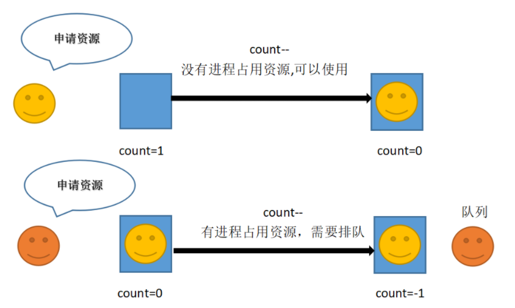

## 进程/线程同步

### 信号量

信号量（semaphore）是操作系统用来解决并发中的互斥和同步问题的一种方法。

信号量是一个与队列有关的整型变量。

那信号量上面值n代表什么意思呢？
n>0：当前有可用资源，可用资源数量为n
n=0：资源都被占用，可用资源数量为0
n<0：资源都被占用，并且还有n个进程正在排队

信号量示意图

[示例程序](./Programs/README.md)

### 互斥量

互斥量(Mutex)和二元信号量类似，资源仅允许一个线程访问。与二元信号量不同的是，信号量在整个系统中可以被任意线程获取和释放，也就是说，同一个信号量可以由一个线程获取而由另一线程释放。而互斥量则要求哪个线程获取了该互斥量锁就由哪个线程释放，其它线程越俎代庖释放互斥量是无效的。

[示例程序](./Sy_Threads.cpp)

模拟火车售票系统

[模拟火车售票系统](./Sy_Threads.cpp)

